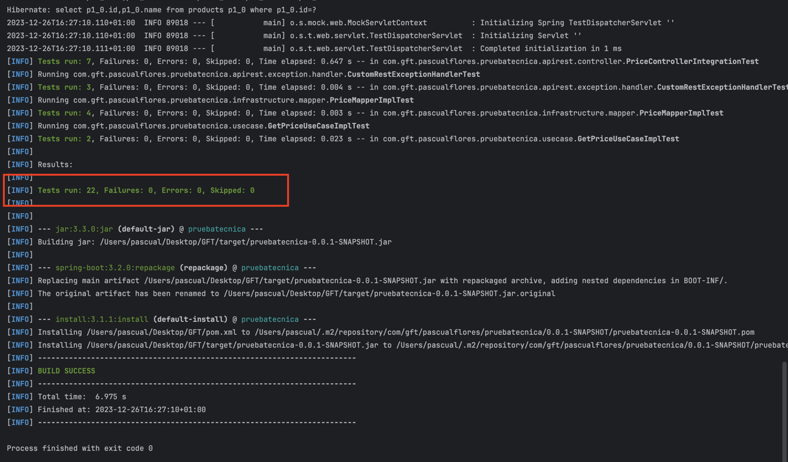

# GFT-Inditex

## Getting Started

These instructions will provide you with a copy of the project running on your local machine for development and
proof.

### Prerequisites

* Docker and Docker-Compose installed locally

### Installing

Clone the project from the GitHub repository

```
git clone https://github.com/paskyecijano/pruebaTecnicaGFT.git
```

Run the following command

```
docker-compose up --build -d
```

With this we will have the project code in a working Docker container.

In this step, the "clean install" command has been executed, which executes all the tests of the project.
You may see something like this:



## Database (h2)

| BRAND_ID | START_DATE          | END_DATE            | PRICE_LIST | PRODUCT_ID | PRIORITY | PRICE | CURR |
|----------|---------------------|---------------------|------------|------------|----------|-------|------|
| 1        | 2020-06-14-00.00.00 | 2020-12-31-23.59.59 | 1          | 35455      | 0        | 35.50 | EUR  |
| 1        | 2020-06-14-15.00.00 | 2020-06-14-18.30.00 | 2          | 35455      | 1        | 25.45 | EUR  |
| 1        | 2020-06-15-00.00.00 | 2020-06-15-11.00.00 | 3          | 35455      | 1        | 30.50 | EUR  |
| 1        | 2020-06-15-16.00.00 | 2020-12-31-23.59.59 | 4          | 35455      | 1        | 38.95 | EUR  |

The test data is stored in a file called schema.sql, which is executed during project startup,
automating the filling of the database.

## Test the app

To test the application, we need to make a GET request with the following URL:

```
http://localhost:8080/api/v1/getPrice?date=2020-06-20T16:00:00Z&productId=35455&brandId=1
```

## Architecture

It has been decided to implement a hexagonal architecture in the project, adhering to the SOLID principles. to help
To understand the structure of the package, I will briefly explain the content of each layer.

Within the domain layer, you will find repository interfaces and use cases, which are later implemented in
the application layer. The infrastructure layer manages interactions with the database. The apirest layer
It encompasses the system endpoints within your Controller.

I use the Singleton pattern for constructor-based dependency injection and the Builder pattern for
creation of objects.

To define the API, I have used Open API 3.0, following the API First approach, which involves the use of a
OpenAPI YAML file containing the API specification.

Exception handling is achieved through ControllerAdvice.

The database itself is in memory (H2), and Hibernate takes care of the automatic creation of relationships between
boards.

Additionally, I leverage Lombok to optimize the code and Mapstruct for efficient data mapping across all layers.
